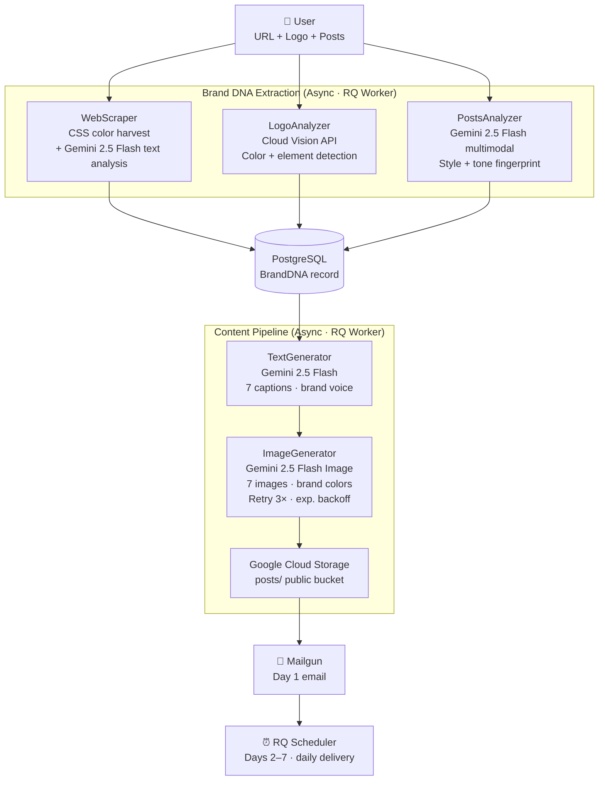

# Agente Cosmic — Brand DNA Extractor & AI Content Agent

> **Google AI Hackathon 2025 · Track 2: Optimize**
>
> An autonomous agent that reads a business URL, extracts its Brand DNA (colors, tone, audience, personality), and generates a full 7-day social media content calendar — images included — delivered straight to the inbox. No manual input beyond a URL.

---

## The Problem

Marketing agencies and freelancers spend **4–6 hours per client** manually studying a brand before creating any content: browsing the website, noting colors, inferring tone, studying competitor posts. Then they repeat this every week.

Small businesses can't afford agencies. Agencies can't scale this process.

---

## The Solution

Agente Cosmic automates the entire Brand DNA discovery and content creation workflow end-to-end:

1. **Drop a URL** (and optionally a logo + sample posts)
2. The agent extracts the brand's personality fingerprint — colors, voice, audience, keywords
3. Generates 7 post captions + 7 on-brand images
4. Delivers Day 1 to your inbox. Days 2–7 arrive automatically, one per day

**From URL to ready-to-publish content in under 3 minutes.**

---

## Architecture



---

## How It Works — Step by Step

| Stage | What happens | Google Cloud service |
|-------|-------------|---------------------|
| **Web Analysis** | Scrapes the URL, extracts CSS hex colors, strips noise, sends clean text to LLM | Vertex AI · Gemini 2.5 Flash |
| **Logo Analysis** | Reads logo image bytes, detects dominant colors and visual elements | Cloud Vision API |
| **Post Analysis** | Analyzes sample posts (images + captions) to infer posting style, avg length, tone | Vertex AI · Gemini 2.5 Flash (multimodal) |
| **Brand DNA** | Merges all signals into a single structured record: `business_name`, `tone`, `audience`, `primary_colors`, `keywords`, `posting_style` | PostgreSQL |
| **Caption Generation** | Generates 7 distinct captions aligned to brand voice and posting style | Vertex AI · Gemini 2.5 Flash |
| **Image Generation** | Creates 7 square images using brand colors and caption concepts | Vertex AI · Gemini 2.5 Flash Image |
| **Asset Storage** | Uploads images to public GCS bucket; returns stable URLs | Google Cloud Storage |
| **Delivery** | Day 1 email sent immediately. Days 2–7 enqueued in Redis scheduler | Mailgun · Redis/RQ |

---

## Tech Stack

| Layer | Technology |
|-------|-----------|
| Backend | Django 5.2 · Python 3.12 |
| Database | PostgreSQL 16 + pgvector |
| Queue | Redis · django-rq · RQ Scheduler |
| AI — Text | Vertex AI · `gemini-2.5-flash` |
| AI — Images | Vertex AI · `gemini-2.5-flash-image` |
| Vision | Cloud Vision API (logo color extraction) |
| Storage | Google Cloud Storage (`agente-cosmic-assets`) |
| Email | django-anymail · Mailgun |
| Infrastructure | Docker Compose · nginx · Cloudflare Tunnel |
| Auth | Google ADC (Application Default Credentials) |

---

## Engineering Reliability (Track 2 Focus)

**This prototype was hardened into a production-grade pipeline:**

- **Async processing**: All brand analysis and content generation runs in RQ workers — the UI shows real-time progress (10% → 30% → 55% → 75% → 100%) while the job runs in the background.
- **Graceful degradation**: If logo analysis fails, CSS colors serve as fallback. If email delivery fails, the job still completes and results display in the UI.
- **Rate limit handling**: Image generation retries up to 3× with exponential backoff (10s → 20s → 40s) on Vertex AI 429 responses.
- **Multimodal color consistency**: CSS hex colors are extracted before HTML stripping, neutral shades (pure whites/blacks/grays) are filtered via brightness + spread algorithm, then passed as grounding context to the LLM — ensuring brand colors appear in generated images.
- **Job lifecycle tracking**: `AnalysisJob` model tracks `status` (pending → processing → complete / failed) and `stage` with percentage — survives container restarts.
- **Containerized & reproducible**: Fully Docker Compose — one command to spin up PostgreSQL, Redis, nginx, Django, and the RQ worker.

---

## Demo

> 🎥 **Video demo coming June 5 — live at** `https://cosmic.anuarbarrera.dev`

**Golden path (< 3 minutes):**
1. Enter business URL (`https://tuweb.mx`) + upload logo PNG
2. Watch the progress bar as the agent extracts Brand DNA in real time
3. Receive a 7-post calendar in your inbox — Day 1 immediately, Days 2–7 auto-scheduled

---

## Business Case

**Target market:** Marketing agencies, freelancers, and small business owners in Latin America (50M+ SMBs, <5% have a defined social media strategy).

**Value proposition:** Reduces content calendar creation from 5 hours → 5 minutes while maintaining brand consistency across 7 days of posts.

**Competitive differentiation vs. tools like Pomelli:**
- Pomelli extracts Brand DNA but leaves content creation to humans
- Agente Cosmic is **fully autonomous**: URL in → published-ready content out
- Works globally without geographic restrictions

**Unit economics:** At $10/month per business, 1,000 clients = $10K MRR with near-zero marginal cost per extra analysis (Vertex AI API pricing).

---

## Innovation Highlights

- **Multimodal Brand DNA extraction**: Combines three independent signals — CSS colors (structured), logo image (visual), and social posts (behavioral) — then merges them into a single coherent personality fingerprint. Each input type uses the appropriate Google AI API.
- **Proactive content delivery**: The agent doesn't wait to be asked. After analysis it schedules 6 follow-up emails autonomously — no human triggers the drip.
- **Color grounding**: Brand colors extracted from logo via Cloud Vision propagate all the way to the image generation prompt, closing the loop between brand identity and generated visuals.

---

## Quick Start

```bash
git clone https://github.com/AnuarBarrera/agente-cosmic.git
cd agente-cosmic

cp .env.example .env
# Fill in: GOOGLE_CLOUD_PROJECT, MAILGUN_API_KEY, and optionally GEMINI_API_KEY
# Set up Google ADC: gcloud auth application-default login

docker compose up -d
docker compose exec backend python manage.py migrate
docker compose exec backend python manage.py collectstatic --noinput
```

Then open `http://localhost:3002`.

**Google Cloud services required:**
- Vertex AI API enabled
- Cloud Vision API enabled
- Cloud Storage bucket created
- Service account with `roles/aiplatform.user` + `roles/storage.objectAdmin` + `roles/visionai.editor`

---

## Project Structure

```
core/
  brand_dna/              # Brand DNA extraction (WebScraper, LogoAnalyzer, PostsAnalyzer)
    extractors/
      web_scraper.py      # CSS color harvest + Vertex AI text analysis
      logo_analyzer.py    # Cloud Vision API color extraction
      posts_analyzer.py   # Gemini multimodal style analysis
  content_pipeline/       # Content generation + delivery
    generators/
      text_generator.py   # Gemini 2.5 Flash caption generation
      image_generator.py  # Gemini Flash Image + GCS upload + retry logic
    email_sender.py       # Mailgun delivery + RQ scheduling
  agent/                  # Legacy: Telegram bot + semantic memory (inherited from miagent)
  shared/                 # Middleware, audit, event bus
saas_chatbot/             # Django settings, urls, wsgi
```

---

## Built by

**Anuar Barrera** · [Tu Web MX](https://tuweb.mx) · [@AnuarBarrera](https://github.com/AnuarBarrera)

Built in 5 days for the Google AI Hackathon 2025.
Powered by Vertex AI · Cloud Vision · Google Cloud Storage.
