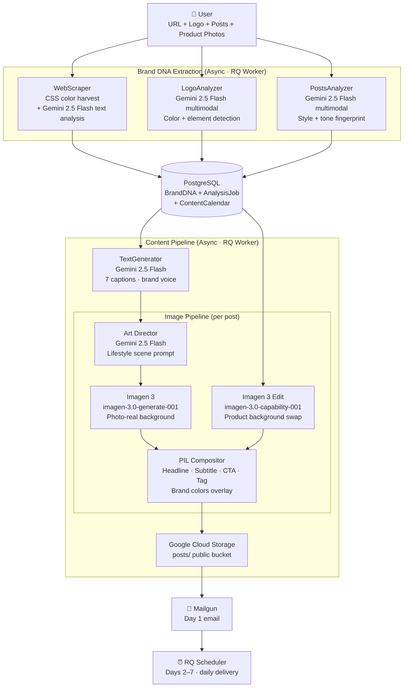

# Agente Cosmic — Brand DNA Extractor & AI Content Agent

> **Google AI Hackathon 2026 · Track 2: Optimize**
>
> An autonomous agent that reads a business URL, extracts its Brand DNA (colors, tone, audience, personality), and generates a full 7-day social media content calendar — images included — delivered straight to the inbox. No manual input beyond a URL.

---

## The Problem

Marketing agencies and freelancers spend **4–6 hours per client** manually studying a brand before creating any content: browsing the website, noting colors, inferring tone, studying competitor posts. Then they repeat this every week.

Small businesses can't afford agencies. Agencies can't scale this process.

---

## The Solution

Agente Cosmic automates the entire Brand DNA discovery and content creation workflow end-to-end:

1. **Drop a URL** (and optionally a logo, sample posts, and up to 7 product photos)
2. The agent extracts the brand's personality fingerprint — colors, voice, audience, keywords
3. A **Gemini Art Director** designs a creative lifestyle scene for each post
4. **Imagen 3** generates photo-realistic backgrounds; **PIL** composites text, CTAs, and tags on top
5. Delivers Day 1 to your inbox. Days 2–7 arrive automatically, one per day

**From URL to ready-to-publish content in under 3 minutes.**

---

## Architecture



---

## Agentic Image Pipeline

Each post image is generated through a **multi-step agentic pipeline** — not a single prompt:

### Path A — Brand Scene (no product photo)
1. **Gemini Art Director** (`_analyze_brand_scene`) analyzes brand tone, keywords, and caption to write a custom lifestyle scene prompt. Banned: offices, laptops, generic workspaces.
2. **Imagen 3** renders a photo-realistic background from that prompt.
3. **Gemini** (`_generate_post_content`) generates headline, subtitle, CTA text, and tag — all in brand voice.
4. **PIL compositor** places text layers over the image with brand palette colors.

### Path B — Product Scene (client uploads product photo)
1. **Gemini Art Director** (`_analyze_product_style`) reads the product image to suggest a premium environment (marble, wooden surface, lifestyle context).
2. **Imagen 3 Edit** (`edit_image` with background swap mask) replaces the background while preserving the product.
3. **Gemini** generates copy in multimodal mode — sees the actual product.
4. **PIL compositor** places text as in Path A.

Gemini decides which path to take per post based on available product images. Posts on days 4–7 without an assigned product photo fall back to Path A.

---

## How It Works — Step by Step

| Stage | What happens | Google Cloud service |
|-------|-------------|---------------------|
| **Web Analysis** | Scrapes the URL, extracts CSS hex colors, strips noise, sends clean text to LLM | Vertex AI · Gemini 2.5 Flash |
| **Logo Analysis** | Reads logo image bytes, detects dominant colors and visual elements | Vertex AI · Gemini 2.5 Flash (multimodal) |
| **Post Analysis** | Analyzes sample posts (images + captions) to infer posting style, avg length, tone | Vertex AI · Gemini 2.5 Flash (multimodal) |
| **Brand DNA** | Merges all signals into a single structured record: `business_name`, `tone`, `audience`, `primary_colors`, `keywords`, `posting_style` | PostgreSQL |
| **Caption Generation** | Generates 7 distinct captions aligned to brand voice and posting style | Vertex AI · Gemini 2.5 Flash |
| **Art Direction** | Gemini Art Director writes a creative scene prompt per post (lifestyle, not generic) | Vertex AI · Gemini 2.5 Flash |
| **Background Generation** | Creates photo-realistic background with Imagen 3 | Vertex AI · Imagen 3 |
| **Product Integration** | When a product photo is provided, Imagen 3 Edit swaps the background while preserving the product | Vertex AI · Imagen 3 Edit |
| **Text Composition** | PIL composites headline, subtitle, CTA, and tag with brand colors on top of the image | Pillow (local) |
| **Asset Storage** | Uploads final images to public GCS bucket; returns stable URLs | Google Cloud Storage |
| **Delivery** | Day 1 email sent immediately. Days 2–7 enqueued in Redis scheduler | Mailgun · Redis/RQ |

---

## Tech Stack

| Layer | Technology |
|-------|-----------|
| Backend | Django 5.2 · Python 3.12 |
| Database | PostgreSQL 16 + pgvector |
| Queue | Redis · django-rq · RQ Scheduler |
| AI — Text & Vision | Vertex AI · `gemini-2.5-flash` |
| AI — Image Generation | Vertex AI · `imagen-3.0-generate-001` |
| AI — Image Editing | Vertex AI · `imagen-3.0-capability-001` |
| Image Composition | Pillow (PIL) — text overlays, brand color extraction |
| Storage | Google Cloud Storage (`agente-cosmic-assets`) |
| Email | django-anymail · Mailgun |
| Infrastructure | Docker Compose · nginx · Cloudflare Tunnel |
| Auth | Google ADC (Application Default Credentials) |

---

## Engineering Reliability (Track 2 Focus)

**This prototype was hardened into a production-grade pipeline:**

- **Async processing**: All brand analysis and content generation runs in RQ workers — the UI shows real-time progress (10% → 30% → 55% → 75% → 100%) while the job runs in the background.
- **Agentic retry with scene rotation**: If Imagen 3 returns a blocked image or fails QC, the Art Director generates a new scene prompt and retries — it never repeats the same failed prompt.
- **Graceful degradation**: If logo analysis fails, CSS colors serve as fallback. If email delivery fails, the job still completes and results display in the UI. 10 static scene fallbacks ensure variety even when Gemini fails.
- **Rate limit handling**: Image generation retries up to 3× with exponential backoff (10s → 20s → 40s) on Vertex AI 429 responses.
- **Multimodal color consistency**: CSS hex colors extracted from the website propagate to the Art Director prompt and PIL compositor — ensuring brand colors appear consistently in generated images.
- **Job lifecycle tracking**: `AnalysisJob` model tracks `status` (pending → processing → complete / failed) and `stage` with percentage — survives container restarts.
- **Soft-delete**: Deleted calendars use `deleted_at` timestamp instead of hard delete, preserving rate limit integrity and preventing orphaned RQ tasks from delivering emails after deletion.
- **Beta user cap**: Registration closes automatically at `MAX_REGISTERED_USERS` (default: 30, configurable via env var). Race condition protected at both render and create time.
- **Per-user rate limits**: Users are limited to N calendars per week and N post regenerations per calendar based on their plan. Soft-deleted calendars still count toward the limit.
- **WebP normalization**: All uploaded images (logos, posts, product photos) are normalized to WebP 85% quality, max 1024×1024px via Pillow before being sent to Vertex AI — consistent MIME types and reduced token usage.
- **Containerized & reproducible**: Fully Docker Compose — one command to spin up PostgreSQL, Redis, nginx, Django, and the RQ worker.

---

## Demo

> **Live at** `https://cosmic.anuarbarrera.dev`

**Golden path (< 3 minutes):**
1. Enter business URL (`https://tuweb.mx`) + upload logo PNG
2. Optionally upload up to 7 product photos — one will appear per post day
3. Watch the progress bar as the agent extracts Brand DNA in real time
4. Review your 7-post calendar in the dashboard — approve posts to confirm
5. Receive Day 1 immediately in your inbox; Days 2–7 arrive automatically

---

## Business Case

**Target market:** Marketing agencies, freelancers, and small business owners in Latin America (50M+ SMBs, <5% have a defined social media strategy).

**Value proposition:** Reduces content calendar creation from 5 hours → 5 minutes while maintaining brand consistency across 7 days of posts.

**Competitive differentiation vs. tools like Pomelli:**
- Pomelli extracts Brand DNA but leaves content creation to humans
- Agente Cosmic is **fully autonomous**: URL in → published-ready content out
- Agentic image pipeline: Gemini Art Director → Imagen 3 → PIL composition (not a single prompt)
- Works globally without geographic restrictions

**Unit economics:** At $10/month per business, 1,000 clients = $10K MRR with near-zero marginal cost per extra analysis (Vertex AI API pricing).

---

## Innovation Highlights

- **Agentic image pipeline**: Three AI models collaborate per image — Gemini Art Director designs the scene, Imagen 3 renders it, Gemini generates the copy (multimodal), PIL composites the final post. No single model does it all.
- **Multimodal Brand DNA extraction**: Combines three independent signals — CSS colors (structured), logo image (visual), and social posts (behavioral) — then merges them into a single coherent personality fingerprint.
- **Product photo integration**: Clients upload their own product photos. Imagen 3 Edit swaps the background into a premium lifestyle environment while preserving the product, then Gemini writes copy that has actually seen the product.
- **Proactive content delivery**: The agent doesn't wait to be asked. After analysis it schedules 6 follow-up emails autonomously — no human triggers the drip.
- **Color grounding**: Brand colors extracted from the website propagate to the Art Director prompt and PIL compositor, closing the loop between brand identity and generated visuals.

---

## Quick Start

```bash
git clone https://github.com/AnuarBarrera/agente-cosmic.git
cd agente-cosmic

cp .env.example .env
# Fill in: GOOGLE_CLOUD_PROJECT, MAILGUN_API_KEY
# Set up Google ADC: gcloud auth application-default login

docker compose up -d
docker compose exec backend python manage.py migrate
docker compose exec backend python manage.py collectstatic --noinput
```

Then open `http://localhost:3002`.

**Google Cloud services required:**
- Vertex AI API enabled (Gemini 2.5 Flash + Imagen 3)
- Cloud Storage bucket created
- Service account with `roles/aiplatform.user` + `roles/storage.objectAdmin`

---

## Project Structure

```
core/
  brand_dna/              # Brand DNA extraction + user-facing views
    extractors/
      web_scraper.py      # CSS color harvest + Gemini text analysis
      logo_analyzer.py    # Gemini multimodal color + element extraction
      posts_analyzer.py   # Gemini multimodal style analysis
    auth_views.py         # Registration with beta user cap (MAX_REGISTERED_USERS)
    rate_limits.py        # Per-user weekly calendar + regeneration limits
    models.py             # AnalysisJob (soft-delete), ContentCalendar, Post
  content_pipeline/       # Content generation + delivery
    generators/
      text_generator.py   # Gemini 2.5 Flash caption generation
      image_generator.py  # Art Director + Imagen 3 + PIL compositor
    image_utils.py        # WebP normalization (Pillow)
    tasks.py              # RQ tasks: content pipeline + email delivery
    email_sender.py       # Mailgun delivery + RQ scheduling
  shared/                 # Middleware, audit, event bus
saas_chatbot/             # Django settings, urls, wsgi
```

---

## Built by

**Anuar Barrera** · [Tu Web MX](https://tuweb.mx) · [@AnuarBarrera](https://github.com/AnuarBarrera)

Built in 7 days for the Google AI Hackathon 2026.
Powered by Vertex AI (Gemini 2.5 Flash + Imagen 3) · Google Cloud Storage · Pillow.
